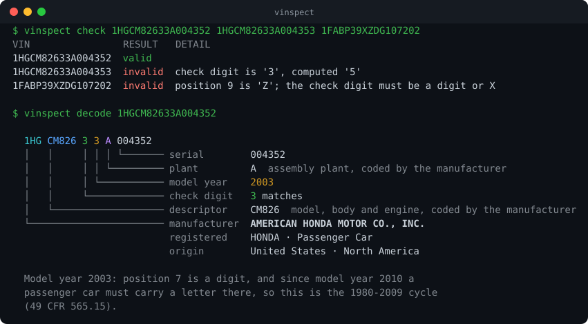

# vinspect

Validate and decode Vehicle Identification Numbers. A Go library and a
single-binary CLI, both offline: the decoder uses only the standard library
and a NHTSA registry snapshot compiled into the binary.

[](https://github.com/ElatDev/vinspect/actions/workflows/ci.yml)
[](https://pkg.go.dev/github.com/ElatDev/vinspect)
[](LICENSE)



## Why this exists

I build dealership software, where VINs arrive typed off a windscreen, scanned
badly, or pasted out of a spreadsheet. The failure I cared about is the quiet
one: a VIN that is seventeen characters and *looks* right. The check digit
catches most of those, and it needs no data at all — it is arithmetic over the
VIN itself.

Most decoders answer by calling an API. This one answers offline, says which
rule it applied, and admits when a VIN genuinely does not determine the answer.

## The checkable claim

<!-- corpus-report -->
**6,516 distinct 17-character VINs**, every one NHTSA recorded for a vehicle in its
crash-test database (13,630 test vehicles, snapshot 2026-09-21), each checked here and against
NHTSA's own vPIC decoder, with the WMI registry snapshot of 2026-09-21.

| Measure | Result |
| --- | ---: |
| **Validation verdict matches vPIC** | **6,495 / 6,516 (99.68%)** |
| &nbsp;&nbsp;valid | 6,389 |
| &nbsp;&nbsp;check digit wrong | 83 |
| &nbsp;&nbsp;illegal character | 44 |
| Accepted by both decoders, so measured below | 6,336 / 6,516 (97%) |
| **Manufacturer matches vPIC** | **6,336 / 6,336 (100%)** |
| &nbsp;&nbsp;WMI absent from the snapshot | 0 |
| **Model year: vPIC's year is one we offered** | **6,336 / 6,336 (100%)** |
| &nbsp;&nbsp;year the regulation guarantees, and vPIC agreed | 3,547 / 3,547 (100%) |
| &nbsp;&nbsp;year position 7 favours, and vPIC agreed | 2,106 / 2,108 (99.91%) |
| &nbsp;&nbsp;two candidates offered, vPIC's year among them | 681 |
<!-- /corpus-report -->

NHTSA records a VIN for every vehicle it crash-tests, and publishes its own VIN
decoder, vPIC. So there is a way to check this library that does not rely on my
judgement: take every VIN NHTSA has ever recorded, decode it here, decode it
there, and compare. Both halves of that corpus are committed, so the comparison
runs offline in CI:

```sh
go test ./internal/corpus -v      # re-checks every claim above
go run ./tools/corpus report      # prints the table, with -detail for mismatches
```

Rebuilding the corpus from NHTSA takes a couple of hours and is resumable:

```sh
go run ./tools/corpus crash       # VINs from the crash-test database
go run ./tools/corpus vpic        # NHTSA's decode of each of them
```

**Where the two disagree.** Twenty-one VINs, which
`go run ./tools/corpus report -detail` lists in full:

- **Eighteen are VINs NHTSA masked itself**, the serial replaced with X's
  (`1FMHK7F97CGA5XXXX`). X is a legal VIN character, so vinspect sees only a
  check digit that does not compute; vPIC also knows that the last five
  characters of a light vehicle's VIN must be numeric.
- **Two are placeholders** that vPIC rejects outright: seventeen zeros — whose
  check digit does compute — and `JDA000L6000823321`.
- **One is a factory mistake NHTSA decided to live with.** A 2024 Genesis G80
  (`KMTGE4S1PRU008162`) carries a `P` in position 9, which cannot be a check
  digit. vinspect calls it malformed; vPIC decodes it clean and says why:
  *"Check Digit Exception - The check digit was given an exception based on
  data from the OEM indicating an error on production."*

Both model years that position 7 pointed the wrong way are 2001 PT Cruisers,
the case described under [what a VIN says](#what-a-vin-says); vinspect prints
those as *likely* rather than certain.

## Install

```sh
go install github.com/ElatDev/vinspect/cmd/vinspect@latest
```

Or download a binary for Windows, macOS or Linux from
[Releases](https://github.com/ElatDev/vinspect/releases). There is nothing to
configure and no data file to ship alongside it.

## Command line

```sh
vinspect check 1HGCM82633A004352      # is it a real VIN?
vinspect decode 1HGCM82633A004352     # what does it say?
```

`check` prints one line per VIN and exits 1 if any of them failed, so it drops
into a pipeline:

```sh
cut -d, -f3 inventory.csv | vinspect check --json | jq -r 'select(.valid | not) | .input'
```

With no arguments (or `-`) VINs are read from standard input, one per line;
blank lines and `#` comments are skipped. `--json` prints one JSON object per
VIN, which is JSON Lines, so `jq` and friends can stream it.

`decode --online` adds model, trim, body, engine and plant city from NHTSA's
vPIC API, batched 50 VINs per request. Everything else works with no network.

```
$ vinspect decode --online 1HGCM82633A004352
...
  NHTSA vPIC
  vehicle       2003 HONDA Accord EX-V6
  body          Coupe, 2 doors
  engine        3.0 L 6-cylinder, 240 hp, Gasoline
  transmission  5-speed Automatic
  built in      MARYSVILLE, OHIO, UNITED STATES (USA)
```

Exit status is 0 if every VIN passed, 1 if any did not, and 2 for a usage
error.

## Library

```go
import "github.com/ElatDev/vinspect/vin"
```

`Validate` answers "could this be a real VIN?", and the error says which rule
broke and where:

```go
if err := vin.Validate(s); err != nil {
	var cde *vin.CheckDigitError
	switch {
	case errors.Is(err, vin.ErrLength):
		// 16 characters, or 18 — a scanner dropped or doubled one
	case errors.Is(err, vin.ErrCharacter):
		// an I, O or Q, or something that is not a VIN character at all
	case errors.As(err, &cde):
		fmt.Printf("check digit is %c, should be %c\n", cde.Have, cde.Want)
	}
}
```

`Decode` answers "what does it say?", and only fails if the input is not
seventeen VIN characters — a wrong check digit is reported, not fatal, because
outside North America and China the check digit is optional:

```go
info, err := vin.Decode("1HGCM82633A004352")
info.Manufacturer.Manufacturer // "AMERICAN HONDA MOTOR CO., INC."
info.Country, info.Region      // "United States", "North America"
info.ModelYear.Year            // 2003
info.ModelYear.Certain         // true: the regulation settles it, see below
info.ModelYear.Basis           // "position 7 is a digit, and since model year 2010 a passenger car must carry a letter there, ..."
info.PlantCode, info.Serial    // "A", "004352"
```

Three packages. The module has no dependencies at all — there is no `go.sum`
in the repository, and the import tools are standard library too:

| Package | What it does |
| --- | --- |
| [`vin`](https://pkg.go.dev/github.com/ElatDev/vinspect/vin) | validate, check digit, decode, model year, ISO 3780 origin |
| [`wmi`](https://pkg.go.dev/github.com/ElatDev/vinspect/wmi) | the embedded NHTSA manufacturer registry |
| [`vpic`](https://pkg.go.dev/github.com/ElatDev/vinspect/vpic) | optional client for NHTSA's online decoder |

Neither path is expensive. On a Ryzen 7 7800X3D, `Validate` takes about 40 ns
and allocates nothing, and `Decode` about 1.3 µs including the manufacturer
lookup, which binary-searches the embedded registry rather than parsing it —
so the binary has no table to build at startup. `go test ./... -bench .`
reproduces those numbers.

## What a VIN says

```
1HG  CM826  3  3      A       004352
└─┬┘ └─┬─┘  │  │      │       └─┬──┘
  │    │    │  │      │         └ serial number       positions 12-17
  │    │    │  │      └ plant                         position 11
  │    │    │  └ model year                           position 10
  │    │    └ check digit                             position 9
  │    └ vehicle descriptor                           positions 4-8
  └ world manufacturer identifier                     positions 1-3
```

**The check digit** is the part that needs no data. Transliterate each
character to a number, multiply by that position's weight, sum, and take the
remainder mod 11 — where a remainder of 10 is written `X`
(49 CFR 565.15(c)). Because 11 is prime and no weight but the check digit's
own is zero, *every* single-character substitution changes the result, unless
the two characters happen to transliterate to the same number — A and J are
both 1. A test in [`vin/vin_test.go`](vin/vin_test.go) walks every substitution
at every position to confirm exactly that.

It earns its keep on real data: the check digit rejects 83 of the VINs in
NHTSA's own crash-test records. One of them, `JTDBT4K3881403266`, becomes
valid when a single character is put right — the `B` in position 11 had been
transcribed as an `8` — and the corrected VIN decodes to the 2011 Toyota
Yaris that the test lab recorded.

**The model year** is honest about what it cannot know. Position 10 runs
through a 30-year cycle, so `3` means 2003 *or* 2033, and position 7 is the
tie-breaker — but only in one direction. Since model year 2010 a car, MPV or
light truck must carry a *letter* in position 7, so a digit there rules the
newer cycle out and the year is certain. A letter only makes the newer cycle
likely: before that rule took effect manufacturers were free to use a letter,
and some did. A 2001 Chrysler PT Cruiser (`3C4FY4BB71T283350`, a real VIN from
the corpus below) carries a `B` there, and a decoder that treats the rule as
symmetric calls it a 2031.

So `Decode` reports which kind of answer it has:

| Position 7 | `Year` | `Certain` | Shown as |
| --- | --- | --- | --- |
| digit, car or MPV | older candidate | true | `2003` |
| letter, car or MPV | newer candidate | false | `2017 (likely)`, `2017?` in tables |
| anything, heavier vehicle | not set | false | `1983 or 2013` |

For trucks, buses, motorcycles and trailers the regulation ties position 7 to
nothing, so both candidates stand and the reason is given rather than guessed:

```
$ vinspect decode 1FTFW1ET9DFC10312
...
  model year    1983 or 2013 (ambiguous)
...
  Model year 1983 or 2013 is ambiguous: NHTSA registers this WMI for trucks,
  and position 7 settles the year only up to 10,000 lb GVWR; if this is a
  light truck it is 2013.
```

**The manufacturer** comes from a snapshot of NHTSA's vPIC registry, embedded
with `go:embed`. Manufacturers who build fewer than 1,000 vehicles a year get a
six-character identifier — positions 1-3 plus 12-14, flagged by a `9` in
position 3 — and the lookup handles both. The registry covers manufacturers
selling into the United States, so an identifier used only elsewhere, such as a
Chinese-market Tesla's `LRW`, is reported as unregistered rather than guessed
at.

## Where the data comes from

| Source | Used for | Refresh |
| --- | --- | --- |
| [49 CFR 565.15](https://www.ecfr.gov/current/title-49/section-565.15) | check digit, model-year rules | hand-coded, cited in comments |
| [ISO 3780 WMI country chart](https://standards.iso.org/iso/3780/ed-4/en/) | region and country from the first two characters | hand-coded in `vin/region.go` |
| [NHTSA vPIC](https://vpic.nhtsa.dot.gov/api/) | manufacturer registry (`wmi/wmi.csv`), online decode | `go run ./tools/wmi-import` |
| [NHTSA crash-test database](https://www.nhtsa.gov/nhtsa-datasets-and-apis) | the verification corpus | `go run ./tools/corpus crash` |

Everything NHTSA publishes is public-domain US government data. The import
tools are rate-limited and cache every response, because NHTSA's CDN blocks
clients that go quickly.

## What this does not do

- **It never generates VINs.** It validates and decodes, and that is a
  deliberate limit rather than a missing feature.
- No database, no server, no web UI.
- No title, theft, recall or ownership history: a VIN alone carries none of
  that.
- The offline path stays standard-library only. The one package that reaches
  the network, `vpic`, is optional and nothing else imports it.

## Development

```sh
go test ./...                             # unit, golden and corpus tests
go test ./vin -fuzz=FuzzValidate          # the validator, fuzzed
go test ./cmd/vinspect -update            # rewrite CLI golden files
go run ./tools/demo                       # regenerate the picture above
```

CI runs the tests on Linux, macOS and Windows, plus `gofmt`, `go vet`,
`staticcheck` and a minute of fuzzing.

## License

MIT — see [LICENSE](LICENSE).
